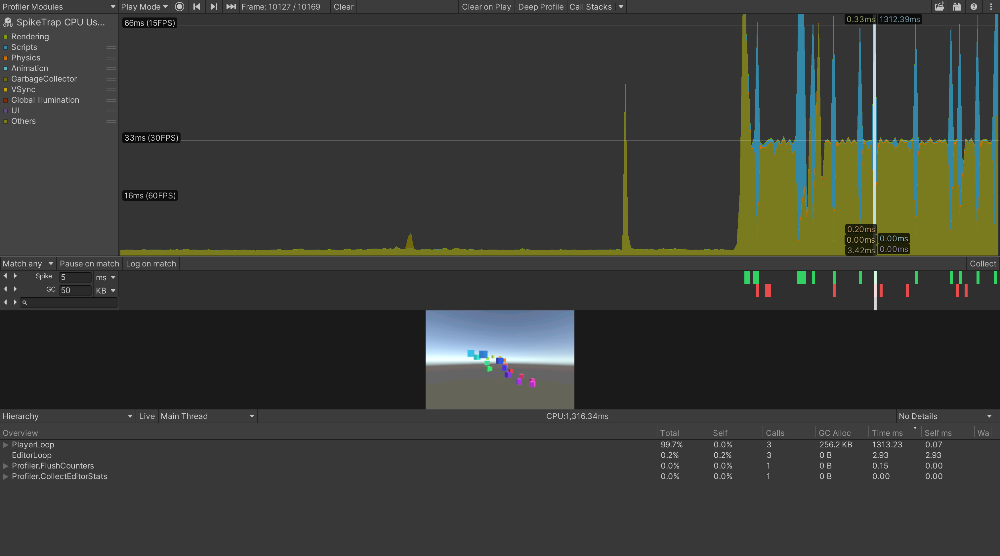
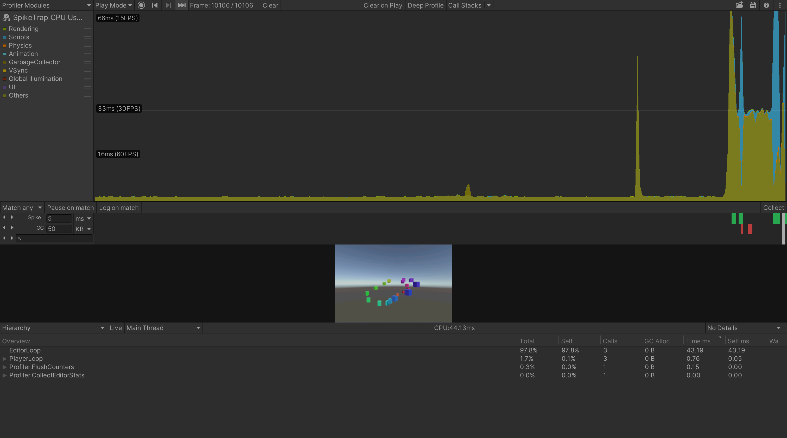
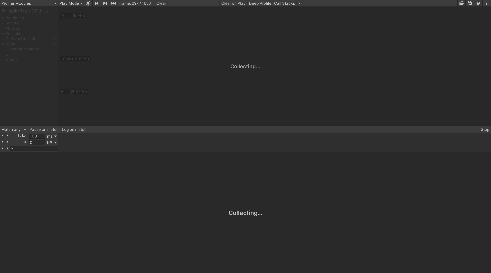

# SpikeTrap

### Set traps, catch bad frames.

**[日本語版はこちら](README_JP.md)**

An enhanced CPU profiler module for Unity Editor with pluggable frame filters, visual highlight strips, AI-driven profiling automation, and marked-frame collection.



## Why SpikeTrap?

Unity's built-in CPU module is a **rolling buffer** — it keeps the last 300-2000 frames and silently discards everything older. At 60fps that's 5-33 seconds of history.

SpikeTrap adds two layers on top:

- **Recording mode** — the standard profiler keeps running, but SpikeTrap adds filter highlight strips, prev/next navigation, pause on match, and log on match. You can spot spikes at a glance without changing how recording works.
- **Collect mode** — set your filter thresholds, press **Collect**, and just play your game. SpikeTrap captures only the frames that matter in the background. No need to stare at the profiler — when you're done, press **Save** to merge matched frames into a single `.data` file.

### Comparison

| | Native CPU Module | SpikeTrap (Recording) | SpikeTrap (Collect) |
|---|---|---|---|
| **Frame retention** | ❌ Rolling buffer (300-2000) | ❌ Same rolling buffer | ✅ Only matched frames, no limit |
| **10 min @ 60fps** (36K frames) | ❌ Loses 95%+ | ❌ Same, but spikes highlighted | ✅ Keeps only ~20 spikes |
| **Rare spike (1/10,000)** | ❌ Overwritten before you see it | ⚠️ Caught if still in buffer | ✅ Captured automatically |
| **Filter types** | ❌ None | ✅ Spike, GC, Search, custom | ✅ Same filters drive capture |
| **Visual indicators** | ❌ None | ✅ Color-coded strips + nav | ✅ Same + "Collecting..." overlay |
| **Filter composition** | ❌ N/A | ✅ Match Any / Match All | ✅ Same logic drives capture |
| **Pause & log on match** | ❌ None | ✅ Auto-pause and/or log | ✅ Available |
| **Automation API** | ❌ Low-level `ProfilerDriver` | — | ✅ `SpikeTrapApi` fire-and-forget |
| **Output** | ⚠️ `.data` (all frames, rolling) | ⚠️ Same | ✅ `.data` (matched only, mergeable) |
| **Hierarchy view** | ✅ Built-in | ✅ Same | ✅ Same |

### How Collect Mode Works

Set your filter thresholds, press **Collect**, and play your game normally. SpikeTrap evaluates each frame against your active filters in real-time — only frames that match (spike threshold exceeded, GC allocation too high, specific marker found) are saved to temporary `.data` files. When you're done, press **Save** to merge them into a single file.

A 100-minute session producing 360,000 frames might save only 50 spike frames — each with full call-stack detail, ready for analysis. You don't lose data to the rolling buffer, and you don't need to watch the profiler while it runs.

This also makes Collect mode ideal for AI-driven profiling. The entire workflow — start collecting, wait, stop, save, analyze — maps to simple `SpikeTrapApi` calls with no frame-by-frame polling or buffer management. An AI agent can kick off a profiling session, let the game run, and retrieve pre-sorted results with marker names already resolved.

## Requirements

- Unity 2022.3+

## Installation

Add via Unity Package Manager using the git URL:

```
https://github.com/piti6/SpikeTrap.git?path=Packages/com.piti6.spike-trap
```

Or clone the repository and copy `Packages/com.piti6.spike-trap` into your project's `Packages/` directory.

## Quick Start

1. Open the Profiler window (**Window > Analysis > Profiler**)
2. Select the **SpikeTrap CPU Usage** module from the module dropdown
3. Set filter thresholds in each strip row (Spike ms, GC KB, search term)
4. Choose **Match any** or **Match all** from the dropdown
5. Toggle **Pause on match** / **Log on match** as needed
6. Use the **Collect** button to record only matched frames

## Features

### Frame Filters

Three built-in filters, each with a visual highlight strip and prev/next navigation buttons:

| Filter | What it detects | Unit selector | Strip color |
|---|---|---|---|
| **Spike** | Frames exceeding a CPU time threshold | ms / s | Green |
| **GC** | Frames exceeding a GC allocation threshold | KB / MB | Red |
| **Search** | Frames containing a named profiler sample (case-insensitive) | — | Orange |



### Match Any / Match All

Control how filters combine with a dropdown in the toolbar:

- **Match any** (OR) — a frame matches if any active filter matches. Default behavior.
- **Match all** (AND) — a frame matches only if all active filters match. A **Result** strip appears showing the intersection with its own prev/next navigation.

Inactive filters (threshold = 0 or empty search) are skipped — they don't affect the result.

### Pause & Log on Match

- **Pause on match** — automatically pauses play mode when filters match a frame
- **Log on match** — dumps the full sample call-stack hierarchy to the console for matched frames

### Collect Marked Frames

Record only frames that match active filters into a `.data` file:

1. Set up filters (spike threshold, GC threshold, search term)
2. Press **Collect** — filter controls stay visible so you can adjust thresholds while collecting
3. Matched frames are saved to temp files as they occur
4. Press **Save (N)** to merge collected frames into a single `.data` file, or **Stop** to exit without saving



### Screenshot Preview

Displays per-frame screenshots captured by the [ScreenshotToUnityProfiler](https://github.com/wotakuro/ScreenshotToUnityProfiler) runtime package inline in the profiler details view. Screenshots persist while scrubbing through frames without screenshot data, and clear on new recording or file load.

Enable screenshot capture at runtime:

```csharp
using SpikeTrap.Runtime;

// Start capturing (default: quarter resolution)
SpikeTrapApi.InitializeScreenshotCapture();

// Or specify scale (0.5 = half resolution)
SpikeTrapApi.InitializeScreenshotCapture(0.5f);

// Custom compression
SpikeTrapApi.InitializeScreenshotCapture(0.25f, TextureCompress.JPG_BufferRGB565);

// Custom capture routine (e.g., capture a specific camera instead of screen)
SpikeTrapApi.InitializeScreenshotCapture(captureBehaviour: target =>
{
    Camera.main.targetTexture = target;
    Camera.main.Render();
    Camera.main.targetTexture = null;
});

// Stop capturing and release resources
SpikeTrapApi.DestroyScreenshotCapture();
```

### Custom Filters

Create your own filters by extending `FrameFilterBase` and registering via `SpikeTrapApi`:

```csharp
using SpikeTrap.Editor;
using UnityEngine;

public class MyFilter : FrameFilterBase
{
    public override Color HighlightColor => Color.cyan;
    public override bool IsActive => true;

    public override bool Matches(in CachedFrameData frameData)
    {
        // Must be thread-safe — called from Parallel.For
        return frameData.EffectiveTimeMs > 16f && frameData.GcAllocBytes > 1024;
    }
}

// Register (e.g., from an editor script or [InitializeOnLoad] constructor)
SpikeTrapApi.RegisterCustomFilterFactory(() => new MyFilter());
```

### Scripting API

`SpikeTrap.Editor.SpikeTrapApi` and `SpikeTrap.Runtime.SpikeTrapApi` provide the API for profiling automation, custom filters, and screenshot capture:

```csharp
using SpikeTrap.Editor;

SpikeTrapApi.StartCollecting(spikeThresholdMs: 33f);
// ... game runs, spikes are captured ...
await SpikeTrapApi.StopCollectingAndSaveAsync("/path/to/spikes.data");

FrameSummary[] spikes = SpikeTrapApi.GetSpikeFrames(33f);
foreach (var s in spikes)
    Debug.Log(s); // "Frame 296: 2038.40ms, GC 5.7KB | NavMeshManager=1953.89ms, ..."
```

### AI Agents & Claude Skills

SpikeTrap is designed code-first: every UI action has an `SpikeTrapApi` equivalent, results come back pre-sorted with marker names already resolved, and analysis works on the static cache without driving the UI. This makes it straightforward to drive from AI agents (Claude Code, uLoop MCP, editor scripts).

The package ships two Claude Code skills under `Packages/com.piti6.spike-trap/.claude/skills/` that wrap common workflows as slash commands:

- **`/spike-trap`** — runs an end-to-end profiling session: enters play mode, collects matched frames, stops, saves to `.data`, and summarizes top bottlenecks by marker name. Also has an `analyze` mode that skips profiling and reports against already-cached data.
- **`/qa-test`** — runs the SpikeTrap QA suite (52 tests across 10 suites: API contracts, collect lifecycle, filter accuracy, threshold updates, discard flow, domain reload survival, marker resolution, UI checks).

```
/spike-trap profile 33ms 10 seconds
/spike-trap analyze 16ms
/qa-test full
```

Why the API works well for agents:

- **Session-scoped, not frame-scoped** — `StartCollecting` / `StopCollectingAndSaveAsync` wrap a full capture. The agent starts, waits, stops — no frame-by-frame iteration or buffer management.
- **Pre-sorted, pre-resolved results** — `GetSpikeFrames` returns frames worst-first with `TopMarkerNames` already resolved. No `ProfilerDriver` plumbing on the agent side.
- **Analysis without UI interaction** — `GetSpikeFrames` and `GetCachedFrameSummaries` read the static cache, so agents can inspect a loaded `.data` file without driving the Profiler window.
- **Session-aware cache** — reloading the same `.data` reuses its cache, so repeated `load → analyze` cycles don't re-extract.

The full agent-facing API reference lives at `Packages/com.piti6.spike-trap/CLAUDE.md`.

## Architecture

### Pluggable Filter System

Filters implement `IFrameFilter` (or extend `FrameFilterBase`). The controller handles all native API access, caching, and matched-frame tracking.

```
Native API (main thread)          Managed cache              Filters (thread-safe)
ProfilerDriver.GetRawFrameDataView  -->  CachedFrameData  -->  filter.Matches()
  one call per frame per session         { EffectiveTimeMs,     pure managed,
  extracts all data in one pass            GcAllocBytes,        parallelized for
                                           UniqueMarkerIds }    large frame ranges
```

**`CachedFrameData`** is a readonly struct containing all filter-relevant data extracted from a single frame. Filters receive this pre-extracted data and never touch native APIs.

**`IFrameFilter`** interface:

```csharp
public interface IFrameFilter : IDisposable
{
    Color HighlightColor { get; }
    bool IsActive { get; }
    bool DrawToolbarControls();
    bool Matches(in CachedFrameData frameData);
    void InvalidateCache();
}
```

### Performance

- **One native call per frame per session**: `GetRawFrameDataView` is called once per frame. All filter data (CPU time, GC bytes, marker IDs) is extracted in a single sample iteration loop.
- **Cached frame data**: Extracted data is stored in a `ConcurrentDictionary`. Threshold/search changes re-evaluate cached managed data without native API calls.
- **Parallel matching**: Full rescans above 500 frames use `Parallel.For`. `OnMarkerDiscovered` and `Matches` are thread-safe.
- **Marker ID caching**: Search filter resolves marker names once per unique ID. Subsequent checks are integer comparisons via `ConcurrentDictionary`.
- **Amortized extraction**: Loading large `.data` files extracts 50 frames per editor frame to avoid blocking.
- **Session-aware caching**: Caches use `frameStartTimeNs` as session fingerprint. Same `.data` file loaded multiple times shares the same cache (A→B→A reuses A's cached data).

### Thread Safety

| Component | Thread-safe | Mechanism |
|---|---|---|
| `SearchFrameFilter.Matches` | Yes | Single volatile `SearchState` reference, local capture |
| `SearchFrameFilter.OnMarkerDiscovered` | Yes | `ConcurrentDictionary.TryAdd`, local state capture (internal to search filter) |
| `SpikeFrameFilter.Matches` | Yes | Reads only immutable `CachedFrameData` fields |
| `GcFrameFilter.Matches` | Yes | Reads only immutable `CachedFrameData` fields |
| `s_FrameDataCache` | Yes | `ConcurrentDictionary` |
| `s_MarkerNames` | Yes | `ConcurrentDictionary` |
| `CollectMatchingFrames` | Yes | `Parallel.For` with `ConcurrentBag` result collection |
| Native API extraction | Main thread only | `GetRawFrameDataView`, `ProfilerFrameDataIterator` |

## Development

This repository is a Unity project. `Assets/ProfilerStressTest.cs` generates random CPU spikes, GC pressure, and named profiler samples (`HeavyComputation`, `GarbageBlast`, `NetworkSync`, `SaveCheckpoint`) for testing.

### Tests

34 EditMode tests (assembly `SpikeTrap.Tests`) covering:
- Spike/GC/Search filter matching logic and edge cases
- Thread safety: concurrent `OnMarkerDiscovered`, concurrent `Matches`, `SetSearchString` race
- Multi-filter OR composition semantics
- Custom filter API usability
- `CachedFrameData` struct correctness

Run via Unity Test Runner (EditMode).

## License

MIT
